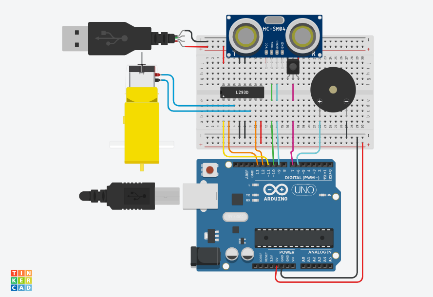
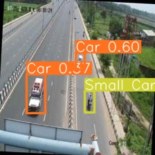

# **SafeDrive: Fog Detection and Accident Prevention**

This groundbreaking initiative aims to significantly improve road safety in foggy conditions through the integration of a sensor array coupled with YOLO v8 object detection. The project provides real-time alerts to drivers and employs automated responses to proactively prevent accidents.

## Methodology

### Sensor Array
- **Ultrasonic Distance Sensor, Blink Sensor, and Buzzer**: These components work in tandem to provide real-time data crucial for ensuring road safety in adverse weather conditions.
    - [TinkerCAD Circuit](docs/circuit.png)
    - [Arduino Sketch](sketchs\test.cpp)

### Object Detection
- **YOLO v8**: The object detection system is powered by YOLO v8, trained on a Kaggle dataset using Miniconda.
    - [Python Scripts](scripts)
    - [Kaggle Dataset](https://www.kaggle.com/datasets/sakshamjn/vehicle-detection-8-classes-object-detection)  

### System Operation
The microcontroller processes sensor data, triggers alerts, and utilizes YOLO v8 for object detection.  

https://www.youtube.com/watch?v=CkR1UowJF0w&pp=ygURZm9nIGRldGVjdGlvbiBtaXQ%3D

## Challenges and Future Improvements

- **Challenges**: Presenting challenges such as limited effectiveness in extreme fog, dependence on sensor accuracy, range limitations, interference, false positives, maintenance requirements, and cost constraints.
- **Future Improvements**: Suggestions for future enhancements include multi-spectral cameras, Li-DAR technology, physical fog sensors, accelerometers for accident detection, and cellular modules for distress messaging.

## Conclusion

Despite challenges, the integration of sensor kits in vehicles represents a transformative leap in automotive safety, especially in foggy conditions. Ongoing research, continuous technological strides, and robust user education are pivotal to overcoming current limitations. With each refinement, these sensor kits edge closer to revolutionizing road safety, promising lives saved, accidents prevented, and overall driving experiences enhanced—especially in adverse weather. As these systems evolve and become more accessible, they stand poised to not only transform driving in fog but to fundamentally redefine the future of road safety.

- [Google Docs](https://docs.google.com/document/d/14IRCxKmYMmovX33k_8StDzK84whqmy6N0cHU5YCVvgQ/edit?usp=sharing)  
- [Google Slides](https://docs.google.com/presentation/d/1Kdm7U59CLaEbMnGa0ZyxNH-HZk0n-zW1RcDiXDOTuV8/edit?usp=sharing)

## License
This project is licensed under the [MIT License](license).